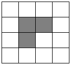

# Problem description

You are given a `n`x`m` square board and pieces as shown in the picture:

What is the minimum amount of pieces needed to put on the board so that there is no space for more pieces.

- Pieces must be aligned to the cells of the board
- Pieces should not overlap
- Pieces can not be split/broken
- Pieces should not stick out of the board

### Solutions for square boards

| 1  | 2  | 3  | 4  | 5  | 6  | 7  | 8  | 9  | 10 | 11 | 12 | 13 |
|:--:|:--:|:--:|:--:|:--:|:--:|:--:|:--:|:--:|:--:|:--:|:--:|:--:|
| 0  | 1  | 2  | 3  | 4  | 6  | 8  | 11 | 14 | 18 | 21 | 25 | 30 |

### Other solutions

|        | 1  | 2  | 3  | 4  | 5  | 6  | 7  | 8  | 9  | 10 | 11 | 12 | 13 |
|:------:|:--:|:--:|:--:|:--:|:--:|:--:|:--:|:--:|:--:|:--:|:--:|:--:|:--:|
| **1**  | 0  | 0  | 0  | 0  | 0  | 0  | 0  | 0  | 0  | 0  | 0  | 0  | 0  |
| **2**  | 0  | 1  | 1  | 2  | 2  | 2  | 3  | 3  | 4  | 4  | 4  | 5  | 5  |
| **3**  | 0  | 1  | 2  | 2  | 3  | 3  | 4  | 4  | 5  | 5  | 6  | 6  | 7  |
| **4**  | 0  | 2  | 2  | 3  | 4  | 4  | 5  | 6  | 6  | 7  | 8  | 8  | 9  |
| **5**  | 0  | 2  | 3  | 4  | 4  | 5  | 6  | 7  | 8  | 9  | 10 | 10 | 11 |
| **6**  | 0  | 2  | 3  | 4  | 5  | 6  | 7  | 8  | 9  | 10 | 11 | 12 | 13 |
| **7**  | 0  | 3  | 4  | 5  | 6  | 7  | 8  | 10 | 11 | 12 | 14 | 15 | 16 |
| **8**  | 0  | 3  | 4  | 6  | 7  | 8  | 10 | 11 | 12 | 14 | 15 | 16 | 18 |
| **9**  | 0  | 4  | 5  | 6  | 8  | 9  | 11 | 12 | 14 | 16 | 17 | 19 | 20 |
| **10** | 0  | 4  | 5  | 7  | 9  | 10 | 12 | 14 | 16 | 18 | 19 | 21 | 23 |
| **11** | 0  | 4  | 6  | 8  | 10 | 11 | 14 | 15 | 17 | 19 | 21 | 23 | 25 |
| **12** | 0  | 5  | 6  | 8  | 10 | 12 | 15 | 16 | 19 | 21 | 23 | 25 | 27 |
| **13** | 0  | 5  | 7  | 9  | 11 | 13 | 16 | 18 | 20 | 23 | 25 | 27 | 30 |
